# WIFI-UDP遥控车

* 遥控器和接收器同时连接到同一个WIFI-AP
* 遥控器连接到接收器的SOFT-AP

## Supported devices

可以使用以下二种模块（使用ESP32可能需要调整IO及少量代码）:

* [ESP8266]()

    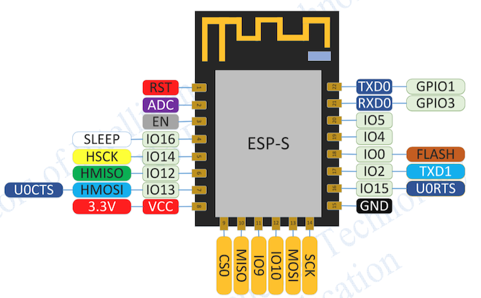
    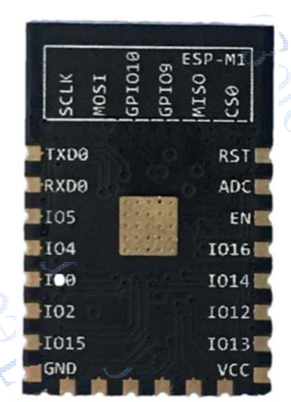
    
* 这里ESP8266资料
    [Quick reference for the ESP8266](http://docs.micropython.org/en/latest/esp8266/quickref.html)

* MicroPython固件下载
    [esp8266-20190515-v1.10-346-ga474ddf95.bin](http://micropython.org/resources/firmware/esp8266-20190515-v1.10-346-ga474ddf95.bin)

    或者在这里选择你需要的版本[download](http://micropython.org/download)

* 烧录MicroPython固件可以使用开源的[nodemcu-PyFlasher](https://github.com/marcelstoer/nodemcu-pyflasher)

    不过这个工具烧录esp32有点问题，不能设置烧录起始地址，可以使用下面的命令来擦除和烧录
    
        esptool.py --chip esp32 --port /dev/cu.SLAB_USBtoUART erase_flash
        esptool.py --chip esp32 --port /dev/cu.SLAB_USBtoUART --baud 115200 write_flash -z 0x1000 烧录档名称.bin

* 更新软件可以使用开源的[ESPlorer](https://www.amobbs.com/thread-5711180-1-1.html)

**Note:** 需要先从 [micropython](http://micropython.org/download) 下载固件到模块。

## 线路图

### 遥控器接线图

* 接线图
 
    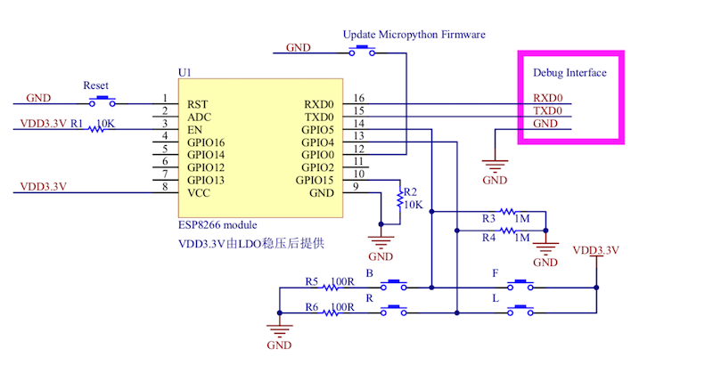
    
* 实物图
 
    
    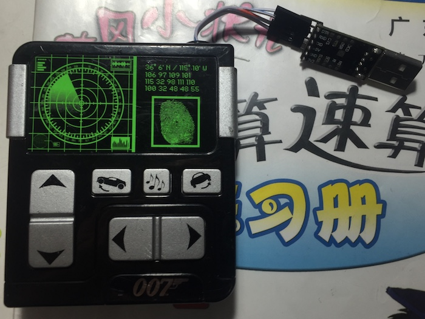

### 接收器接线图

* 接线图

    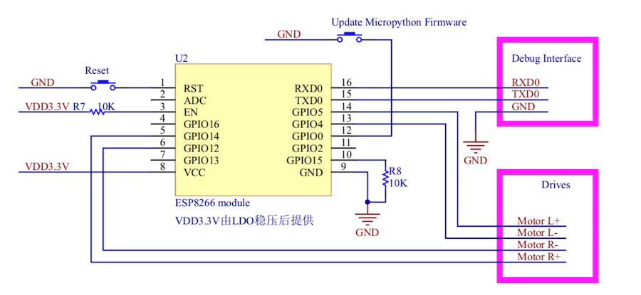

* 实物图

    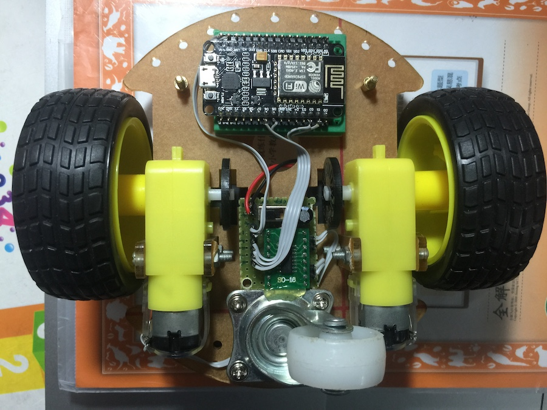
    
    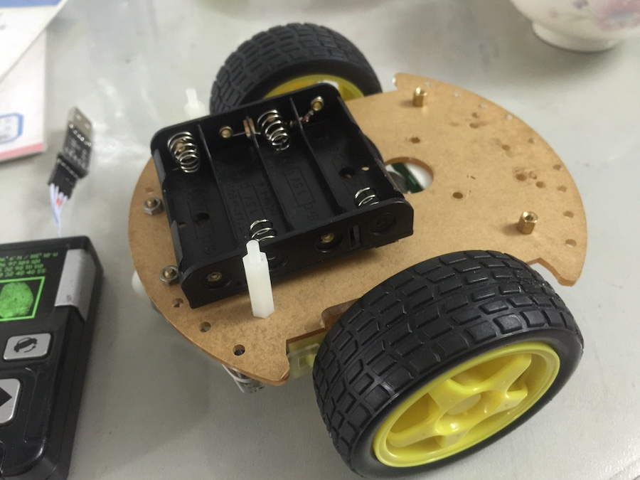

## 软件库

**Note:** 需要先从 [micropython](http://micropython.org/download) 下载固件到模块。

    

## Source Code

    config.py说明：
        写入摇控器时设置
        name = 'remote_control'
    
        写入接收器时设置
        name = 'car'
    
    如果你想使用路由器中转，可以将两个ssid_key都改成: 'your_ssid': 'your_password'
    
    目前已知问题：
          要小心电池不太足时，同时马达电流过大时，WIFI有可能断开。
          需要加入LED或OLED指示状态

    

## Debug

	* 开始烧录MicroPython固件
  		* 先将串口通过USBtoUART接入电脑，并确认驱动正常，串口正常
  		* 按住GPIO0的按键不松开，按一下RST按键，进入烧录模式。
		* 开始烧录
		
   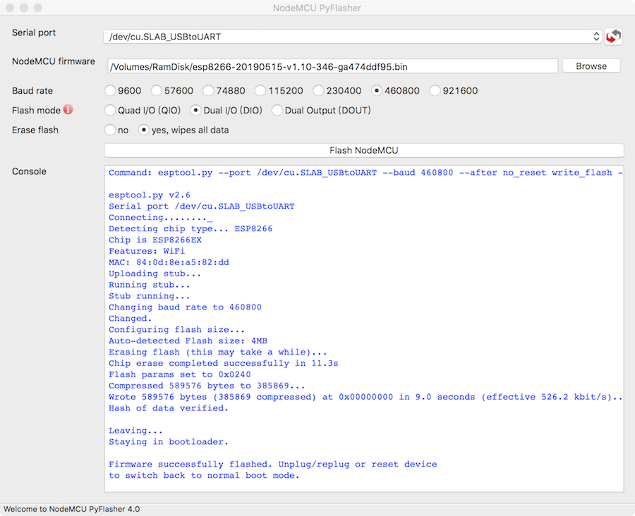
	
    * 按RST键复位，可以看到串口先是输出一串乱码，还后是MicroPython版本信息，输入help()可以看到一些提示
   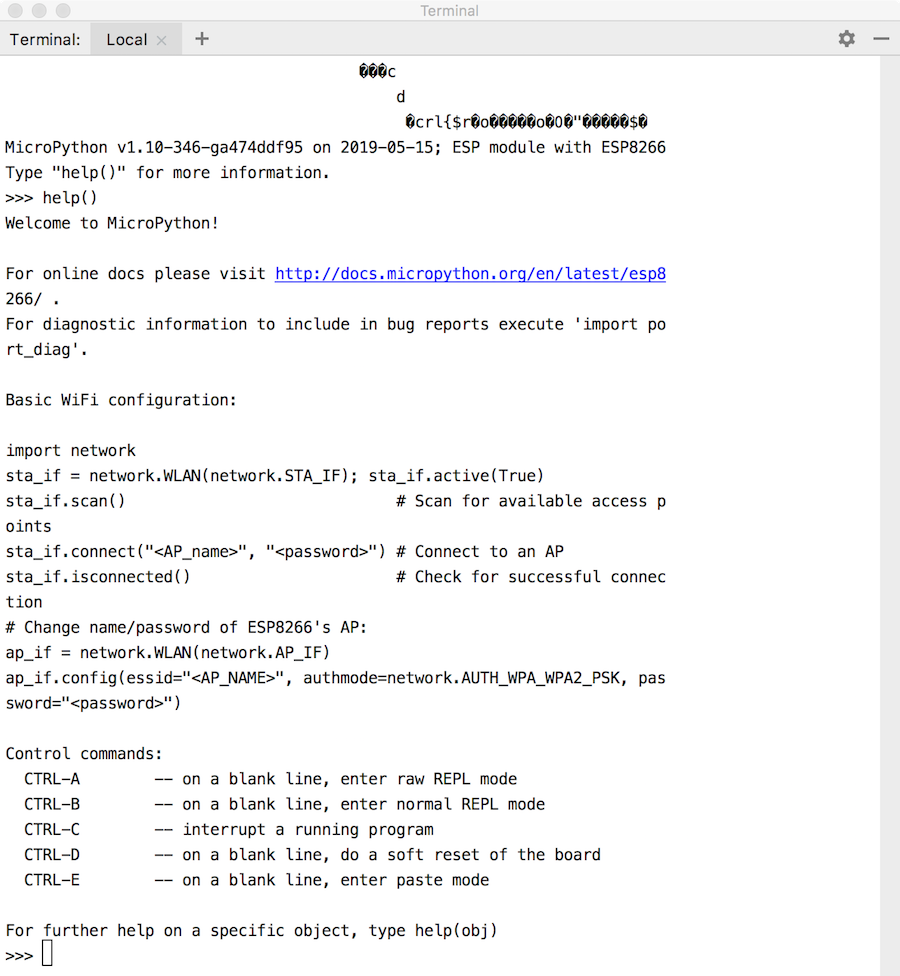

	
    * 测试马达驱动电路
   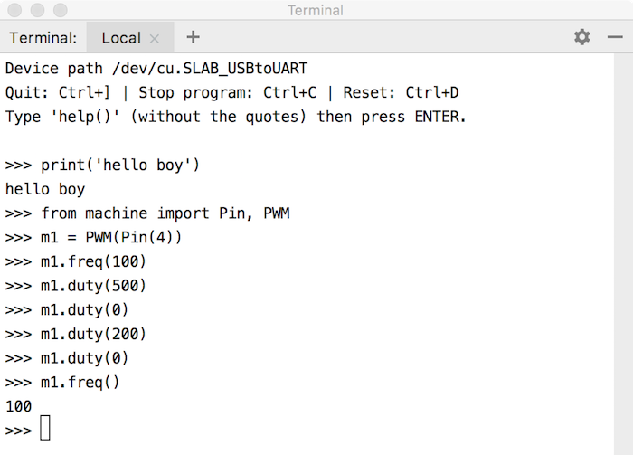

接下来开始打通网络WebREPL, 打开控制台：

    >>>import webrepl_setup
                   这时会显示提醒WebREPL是disable的，并询是是否打开
    >>>E
                   输入E开启上电时自动启动WebREPL功能
                   并按提示输入你的新密码，及确认密码，然后重启
    
    此时，可以用ESPlorer或控制台查看到 MicroPython目录自动生成二个文件boot.py(启动文件) webrepl_cfg.py(保存WEBREPL密码)
    
    然后在控制台开启AP，设置一个ID/密码
    >>> import network
    >>> ap = network.WLAN(network.AP_IF)
    >>> ap.active(True)
    >>> ap.config(essid='ROBOT', password='robotrobot')
    
    * 打开手机，先连接到micropython.ort/webrepl/ 等待浏览器页面打开
    * 然后用手机寻找WIFI-AP ： ROBOT， 并连接，密码就是刚长设置的robotrobot
    * 回到浏览器，可以看到页面上有一个初始的目标IP：ws://192.168.4.1:8266 , 不用修改，点击Connect按钮连接
    * 页面会提示输入Password: , 输入之前设置的WebREPL密码, 回车后可以看到提示： WebREPL connected
    * 输入代码测试一下  >>> print(5*5),  返回25那么说明连接成功
    * 这个页面还可以上传文件到esp8266, 以及从esp8266读取文件
    
    PS: 当然也可以不用AP方式，直接让esp8266连接到路由器也是可以的, 记得把连接页面的ws://xxx:8266/的xxx换成esp8266的IP就可以了
        nic = network.WLAN(network.STA_IF)
        nic.active(True)
        nic.connect(your_ssid, your_password)
        
   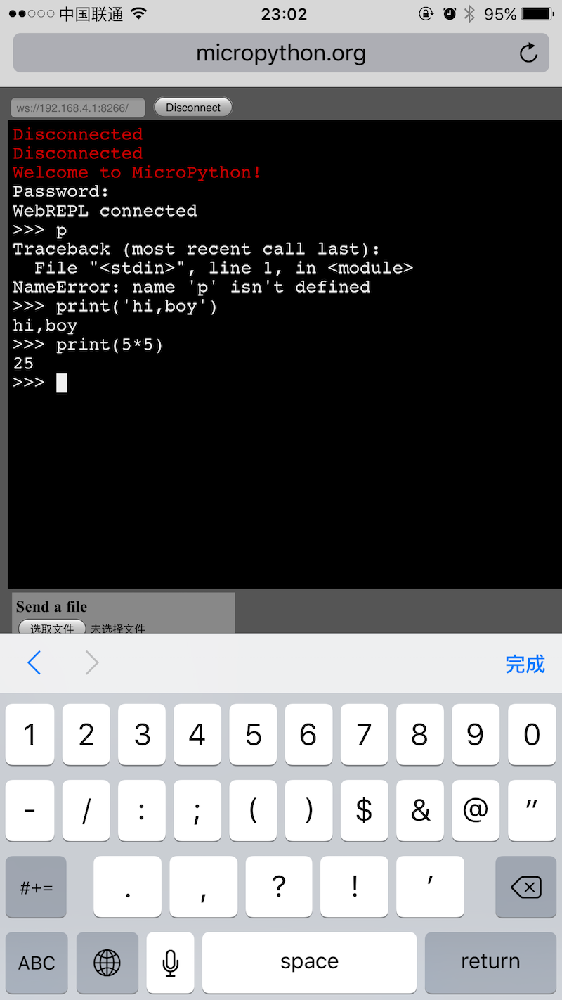

# 网页控制功能

将手机或电脑连接到接收器热点：ROBOT，密码robotrobot, 打开浏览器输入192.168.4.1打开控制页面

# 微信小程序

将APPID改成你的编译就可以了。
控制方式使用的是（摇杆）前后左右及调速，我在想如果方向改成化分角度控制会更好一些，已经有角度值rad了所以也不难，有空再弄吧。

有个坑1,需要微信版本最高才可以使用，因为微信才刚刚支持UDPSocket
有个坑2,需要先打开小程序，再让WIFI连接到ROBOT
[!wechat](/media/wechat.png)